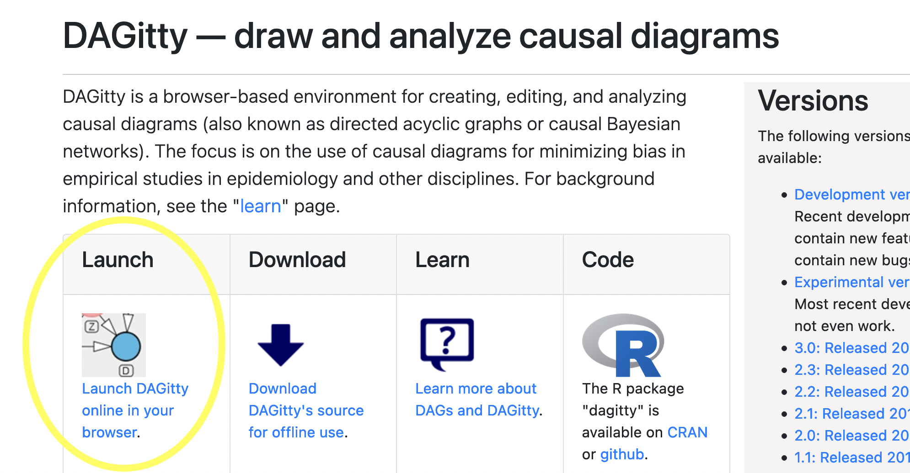
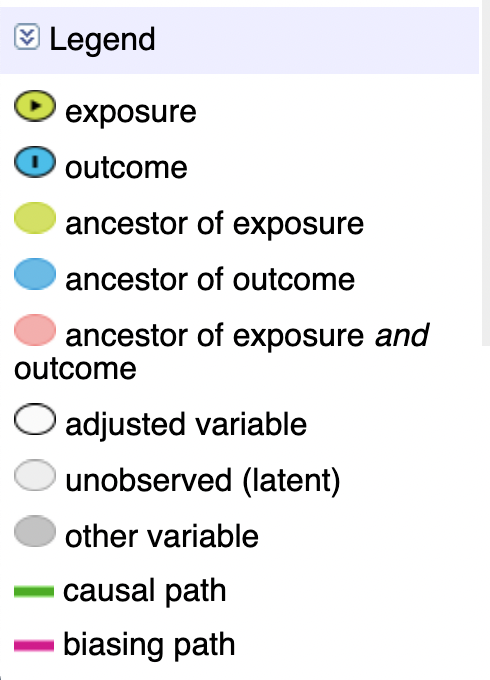
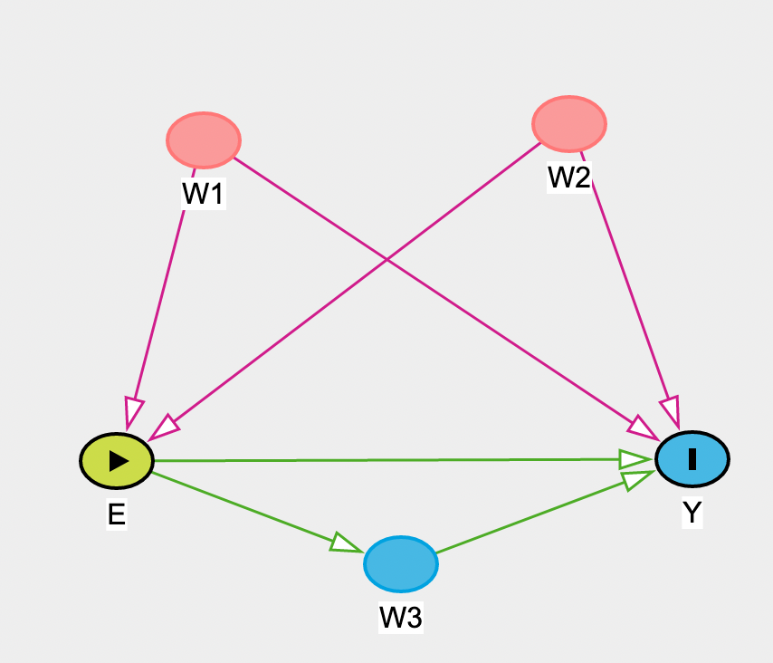

Continuing with our Causal Week Brown Bag Sessions, this is a quick series of activities to get us comfortable with dagitty and ggdag functionality. Here, we're going to:

1) create a dag through the daggity website;
2) identify key components of a dag and important shortkeys;
3) identify some components and graph the dag with the daggity package in R; and
4) review additional functionality using ggdag package.

*DISCLAIMER: this is very brief and in no way comprehensive of the functionality of dagitty or ggdag. See references for further review materials. *

**Souce code: [Github](https://github.com/nerissanance/kp_dag/blob/master/daggity_and_ggdag.Rmd)**

## Creating a dag with dagitty online

An easy way to create dags online is on the [dagitty website](http://www.dagitty.net/dags.html).

As you can see from the home page, Dagitty is developed and maintained by Johannes Textor (Tumor Immmunology Lab and Institute for Computing and Information Sciences, Radboud University Nijmegen), though many folks have contributed to the source code development. If you end up using Dagitty in your research, be sure to cite approriately!


We can view a simple dag on the dagitty website by naivating here:

{width=50%}


...and you can edit it using the following shortkeys by holding your cursor over the node of interest and pressing:

<!-- ::: l-body-outset -->

| Key  | Usage |
|----------|----------|
| D                 | Deletes node        |
| R                 | Renames node  |
| A                 | Changes node to being adjusted/unadjusted |
| N                 | Makes new node |
| U                 | Changes a node to be unobserved/observed |
<!-- ::: -->


You can see a legend of the different node and path colors on the lower lefthand side, as so:

{width=30%}


Let's try it out! 

#### Activity 1: Causal identification with colliders

1) Let's start with the template dag given to you by dagitty. what happens when you adjust for Z (hold your cursor over Z and press "A")? What happens to the causal effect identification in the upper lefthand corner, and why?
2) What about if you additionally adjust for either A or B?
3) You can add/subract the arrows by clicking one node of interest, and then the other. Try doing this now by adding an arrow from Z to D. What happens to the total effect identification?
4) Adjust a minimally sufficient set of nodes to control for confounding.

-------

#### Activity 2: Making a dag in dagitty online

Often times in causal literature (for point-treatment effects), variables will be denoted as follows:

- A = exposure node
- Y = outcome node
- W = confounder node(s)

1) Use the shortcuts above to make a dag that looks like the one below:

{width=50%}

2) What do the "testable implications" on the right hand side say? What conditional independences do you see? Find them also on the graph.
3) Now adjust for W1 and W2. What effect are we now measuring?
4) Now additionally adjust for W3. What effect are we measuring now?

------

## Examining dags in R with dagitty

Copy the code in the "model code" section on the righthand side into you R console, if you have access to R. You will need to run `install.packages("dagitty")` if you don't have the package already. You will also need to enclose the dag code in quotes and in the dagitty function, as seen below:

```{r, eval=T, include=T, echo=T}
#install.packages("dagitty")
library(dagitty)

dag <- dagitty(
  'dag {
A [exposure,pos="-1.243,0.333"]
W1 [pos="-1.031,-0.585"]
W2 [pos="-0.140,-0.632"]
W3 [pos="-0.550,0.629"]
Y [outcome,pos="0.160,0.328"]
A -> W3
A -> Y
W1 -> A
W1 -> Y
W2 -> A
W2 -> Y
W3 -> Y
}'
)

plot(dag)
```


Now that we have our dag, we can perform a variety of functions on the dag to examine different relationships such as ancestors and descendents.


```{r, eval=T}

ancestors( dag, "Y" )
descendants( dag, "A" )

```

We can also look at all the paths between variables such as A and Y (the `open` object shows us whether the paths are open or closed):
```{r}
paths( dag, "A", "Y")$open
paths( dag, "A", "Y")$paths
paths( dag, "A", "Y", directed=T)$paths
```

We can examine the conditional independencies in the dag:
```{r}
impliedConditionalIndependencies(dag)
```

We can also look at the possible adjustment sets (in our case there is only one, but in other cases there may be more than one):
```{r}
adjustmentSets(dag)
```

If we adjust for these variables, we will no longer have open paths between the exposure and outcome:

```{r}

adjustedNodes(dag) <- c("W1","W2")

paths( dag, "A", "Y", c("W1","W2") )

```


*Ok, that was fun, but why both with this if we can do it all on the dagitty website?*

R can be helpful if you want to have replicable code that saves a complex dag, examine conditional independencies, explore different adjustment sets, etc. We won't go over this today, but there are also ways to test relationships in a dag through simulations in R. 

If you don't want to use R, though, you can save directly to dagitty.net by clicking "publish" under the "model" tab above the dag. 

------

#### Activity: R to dagitty online

Let's try a more complex graph now. 

```{r}

set.seed(2342)

rdag <- dagitty(dagitty::randomDAG(10, .5))
rdag
exposures(rdag) <-"x1"
outcomes(rdag) <- "x5"

plot(graphLayout(rdag))

```

If you have RStudio open, run the above code (also accessed on the [Github](https://github.com/nerissanance/kp_dag/blob/master/daggity_and_ggdag.Rmd)) and try pasting the resulting dag directly into the daggity.net "model code" section on the righthand side. Poof! It renders a dag.

1) Is there confounding in this graph?
2) What happens when you adjust for X8?

------

## Examining dags in R with ggdag

For the R users out there, the ggdag may be useful to you. It is a package that's built on top of dagitty to extend its functionality to work in the world of tidyverse. 

The `tidy_dagitty()` command creates a tibble with the dag's details (coordinates, direction of effect, etc.):

```{r, echo=F, include=F}

library(ggdag)
```
```{r}
tidydag <- tidy_dagitty(dag)
tidydag

```

For the most part this is nice for visualizing the dag quickly and easily with ggplot:

```{r}
 ggplot(tidydag,aes(x = x, y = y, xend = xend, yend = yend)) +
    geom_dag_point() + #this initializes the nodes
    geom_dag_edges() + #this initializes the arrows
    geom_dag_text() + #this labels the nodes
    theme_dag() #this removes the axes from the graph 

```


You can look at paths between exposure and outcome:
```{r}

ggdag_paths(dag)

```

Visually examining parents and children of a specific variable:

```{r}
ggdag_parents(dag, "Y")
```

Or visualizing the adjustment set needed for your exposure-outcome total effect:
```{r}
ggdag_adjustment_set(dag)

```


You can review reference material for more details.

--------

### That's all for now!

Hopefully this was enough to get you started with dagitty (and ggdag), and that you now:

1)  can create a dag through the daggity website;
2) can identify key components of a dag and important shortkeys;
3) know how to identify some components and graph the dag with the daggity package in R; and
4) can use some of the graphs from the ggdag package to identify relationships in your dag.


# References 

Johannes Textor, Benito van der Zander, Mark S Gilthorpe, Maciej Liśkiewicz, George TH Ellison, Robust causal inference using directed acyclic graphs: the R package ‘dagitty’, International Journal of Epidemiology, Volume 45, Issue 6, December 2016, Pages 1887–1894, https://doi.org/10.1093/ije/dyw341

http://www.dagitty.net/learn/index.html

http://www.dagitty.net/manual-2.x.pdf

https://cran.r-project.org/web/packages/dagitty/dagitty.pdf

http://dagitty.net/primer/

https://cran.r-project.org/web/packages/ggdag/vignettes/intro-to-ggdag.html

https://ggdag.malco.io/ 


